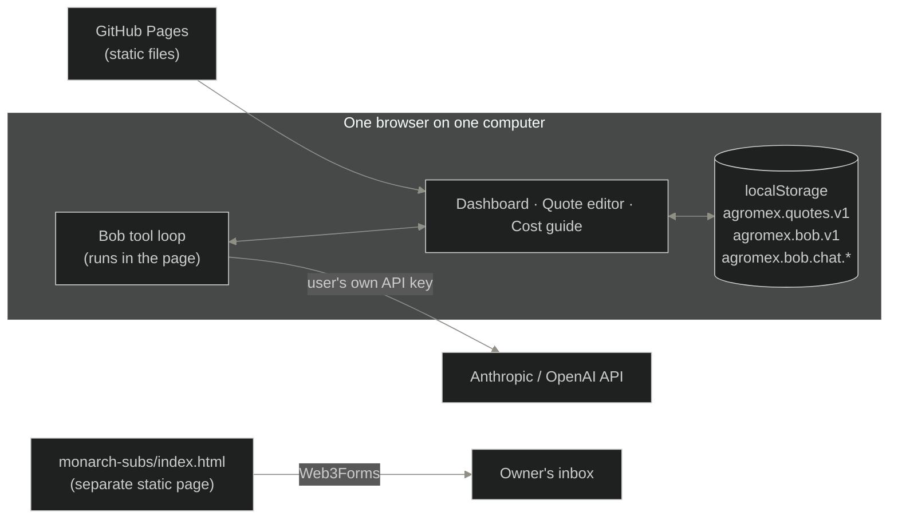
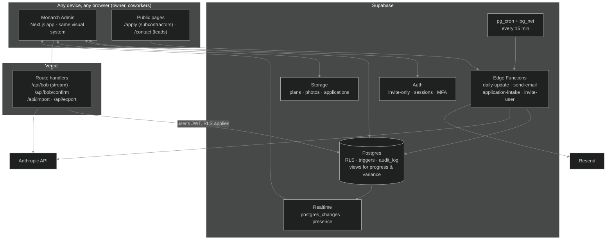
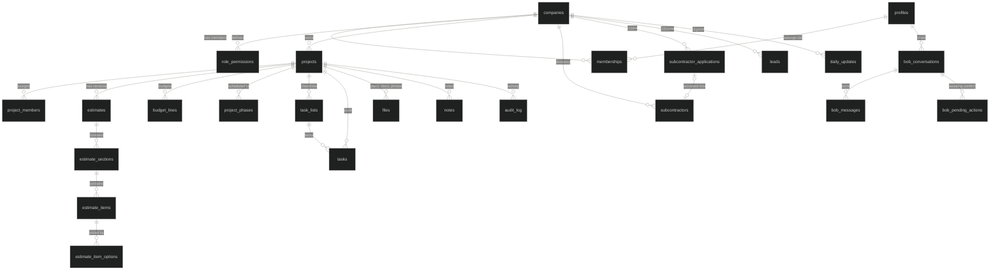
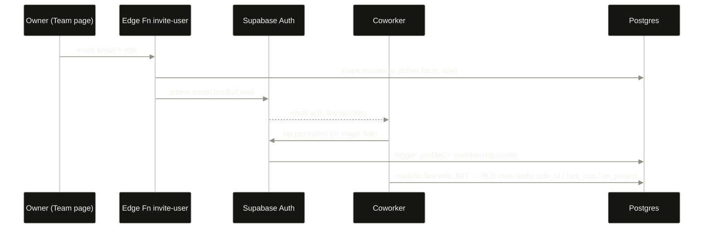
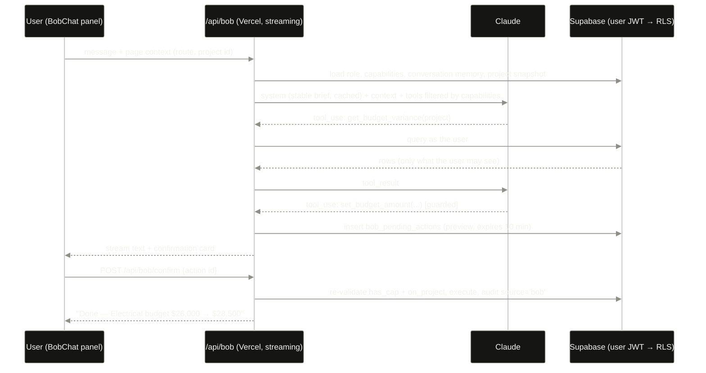
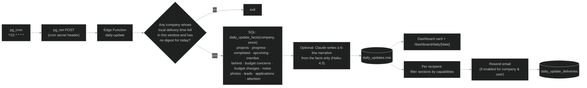
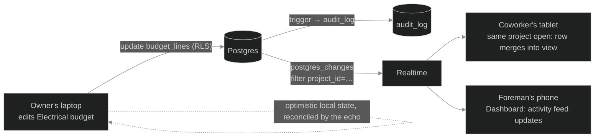

# Monarch Admin — Architecture & Migration Plan

| | |
|---|---|
| **Status** | Proposal. Nothing in this document is implemented yet. |
| **Basis** | Branch `claude/construction-quote-tool-rdnb0p` at commit `e9c92da` (2026-08-31, "Add HD-search button on option rows and voice input for Bob"), plus the subcontractor onboarding branch `claude/cloudflare-subcontractor-onboarding-g7k23k` at `5f39ead`. |
| **Date** | 2026-09-02 |
| **Author** | Prepared by Claude Code for the Monarch Admin owner. |

> **About the uploaded zip.** The `agromexquotesheet.zip` attachment could not be downloaded from this environment (the file link sits behind a browser-only challenge). The estimator was inspected from the repository branch above instead. If the zip contains changes newer than commit `e9c92da`, push them to that branch and the deltas can be folded into this plan.

---

## Decisions at a glance

1. **The estimator is the foundation, not a starting point to replace.** Its visual system (`app/globals.css`), its data types (`lib/types.ts`), its pure calculation engine (`lib/format.ts`, `lib/estimator.ts`) and its screen components carry forward. Monarch Admin is the estimator grown outward, with the same night-drafting-board look on every new sheet.
2. **Supabase becomes the central backend.** Postgres with row-level security holds every record; Supabase Auth handles login and invitations; Supabase Storage holds plans, documents and photos; Realtime pushes changes to every open device; Edge Functions plus `pg_cron` run the daily update on a server schedule. Inspection found no technical reason to prefer anything else, and several reasons it fits (see §4.2).
3. **The app stops being a static export and gains a server.** Bob needs a server-held AI key, the daily update needs a scheduler, and multi-user data needs enforced permissions. The Next.js codebase stays; `output: "export"` goes; the recommended host is Vercel, with Supabase carrying all server-side logic that must run without the web host.
4. **Estimate data is normalised into tables, while the components keep the shape they already use.** A thin persistence layer (a "diff writer") turns the existing `update(prev => next)` calls into row-level writes, so `SheetTable`, `TotalsPanel`, `EstimatorPanel` and Bob's tool executor do not change.
5. **Roles and permissions exist from day one**, as data the Owner can edit, enforced in the database (RLS) and mirrored in the UI. Bob runs with the logged-in user's permissions and can never exceed them.
6. **Audit history is a first-class table**, written by database triggers for field-level old→new changes and by the application for human-readable summaries.
7. **Work is staged in eight phases**, each shippable on its own, with module boundaries that let any one module grow later without touching the rest.

---

## 1. Current architecture discovered in the existing estimator

### 1.1 Where it lives

The repository `prestonaguinaga/Agromex-Direct` holds three different applications on three branches:

| Branch | What it is | State |
|---|---|---|
| `claude/business-website-portfolio-gpu2ws` (repository default / HEAD) | "OPENSIGN Studio" marketing site with three demo sites and a Formspree contact form. | Unrelated to the estimator; leads arrive by Formspree or `mailto:`. |
| `claude/construction-quote-tool-rdnb0p` | **The Agromex construction quote sheet — the estimator.** Branched from the marketing site and replaced it wholesale. Deployed by GitHub Actions to the `gh-pages` branch (`https://prestonaguinaga.github.io/Agromex-Direct/`). | Latest work, 2026-08-31. |
| `claude/cloudflare-subcontractor-onboarding-g7k23k` | Subcontractor onboarding forms: one inside the marketing site (`app/subcontractors/`) and one standalone bilingual page (`monarch-subs/index.html`) branded **Monarch Construction, Dallas–Fort Worth**. | 2026-09-01. Independent of the estimator branch. |

The estimator branch descends from the marketing-site base commit, so this session's branch (`claude/monarch-shared-construction-gcvtx0`) has been fast-forwarded onto the estimator head. Monarch Admin should continue from there; the marketing site and the onboarding page are folded in as public routes later (Phase 5).

### 1.2 Stack

- Next.js 16 (App Router) with `output: "export"` and `trailingSlash: true` → a folder of static HTML; no server, no API routes, no database.
- React 19, TypeScript 7, Tailwind CSS 4 via `@tailwindcss/postcss`; design tokens declared in a `@theme` block.
- `@anthropic-ai/sdk` bundled into the browser for Bob (with `dangerouslyAllowBrowser: true`).
- `motion` and `clsx` are listed in `package.json` but are inherited from the marketing site; the estimator sources do not import them.
- No test runner, no ESLint configuration (`next lint` is declared but unconfigured), `package.json` still named `opensign`.
- Deployment: `.github/workflows/deploy.yml` builds with `NEXT_PUBLIC_BASE_PATH=/Agromex-Direct` and force-pushes `out/` to `gh-pages`.

### 1.3 Routes and screens

| Route | File | Kind | What it does |
|---|---|---|---|
| `/` | `app/page.tsx` | client | **Projects dashboard**: title block ("Sheet 01 · Project index"), project count and combined quote value, project cards (type, date, name, client, grand total, checklist progress bar, Open / Duplicate / Delete), export/import JSON backup, new-project wizard (name → remodel/new build → premade checklist). |
| `/project/?id=…` | `app/project/page.tsx` | client | **Quote editor**: header with editable name, running total, Email and Print buttons; three tabs — *Quote sheet* (`SheetTable` + sticky `TotalsPanel`), *Estimator* (`EstimatorPanel`), *Info & plans* (`InfoPanel`). `BobChat` floats bottom-right. `PrintSheet` renders only on print. Project id travels as a query parameter because static export cannot build dynamic segments. |
| `/guide/` | `app/guide/page.tsx` | server (static) | **Cost guide**: researched reference data (new-build phases, remodel ranges, takeoff formulas, framing math, material tiers). Read-only. |

Navigation is the `TopBar` (`components/ui.tsx`): wordmark with blinking cursor, "Projects" and "Cost guide" tabs, and a live `T·HH:MM` clock.

### 1.4 Data model (`lib/types.ts`)

```
Project
├─ id, name, type: "new-build" | "remodel", template, createdAt, updatedAt
├─ info: { client, phone, address, sqft, footprintSqft, stories, ceilingFt,
│          bedrooms, bathrooms, roofPitch, notes }
├─ settings: { taxPct, wastePct, laborPct, contingencyPct }
├─ sections[]: { id, name, collapsed?, items[] }
│    └─ items[]: LineItem { id, name, qty, unit, options[], activeOptionId, done, note? }
│         └─ options[]: ItemOption { id, label, url, unitPrice | null, note? }
├─ plans[]: PlanFile { id, name, type, size, dataUrl }   ← files stored inline as base64
└─ planNotes
```

Every line item holds one or more product options; only the *active* option is priced. `done` doubles as the checklist state, and the dashboard's progress bar is `doneItems / totalItems`.

### 1.5 Persistence (`lib/store.ts`)

- One `localStorage` key, `agromex.quotes.v1`, holding `{ version: 1, projects: Project[] }`.
- `useProjects()` (dashboard) loads on mount and writes the whole array synchronously on every mutation.
- `useProject(id)` (editor) loads one project, applies `update(prev => next)` to React state, stamps `updatedAt`, debounces the write 400 ms, and flushes on unmount / `beforeunload`.
- `exportJson()` / `importJson()` produce and merge a backup file (imported ids win).
- Storage-full errors surface as a banner; `InfoPanel` caps attachments at ~2 MB per file and ~3.5 MB per project because the whole store must fit in the browser's ~5 MB quota.

Nothing leaves the device. Two browsers, or two people, never see the same data.

### 1.6 Calculation engine (pure functions, no I/O)

- `lib/format.ts` — `uid()`, money/number formatting, `parseMoney`, `parseProductLink` (cleans Home Depot / Lowe's / Amazon links and extracts a title), `activePrice`, `lineTotal`, and **`computeTotals`**:
  `materials = Σ active price × qty` (priced lines only) · `waste = materials × wastePct` · `tax = (materials + waste) × taxPct` · `labor = materials × laborPct` · `contingency = (materials + waste + tax + labor) × contingencyPct` · `grand = sum`.
- `lib/estimator.ts` — whole-house takeoff (`derive`, `estimateHouse`), single-wall calculator (`estimateWall`), low–high totals, and `linesToSections` which turns an estimate into `EST — <phase>` sections.
- `lib/templates.ts` — five premade checklists (new build 17 phases, kitchen, bath, whole-home, blank) and `createProject`.
- `lib/research.ts`, `lib/research-full.ts`, `lib/research-framing.ts` — generated research datasets (cost per sq ft, remodel ranges, 16-category option tier library with Home Depot search links, framing rules).
- `lib/sheetText.ts` — plain-text quote for the `mailto:` Email button.

### 1.7 Bob, the site assistant (`lib/bob/*`, `components/BobChat.tsx`)

- **Provider layer** (`provider.ts`): the same tool loop for Anthropic and OpenAI, run **in the browser with the user's own API key**. Anthropic calls use a cached stable system prompt plus a per-turn "sheet snapshot", `max_tokens 8192`, medium effort, up to 8 tool rounds, and Anthropic's server-side `web_search` / `web_fetch` tools so Bob can find real product links.
- **Tool layer** (`tools.ts`): ten tools, every one a pure transition on `Project` — `add_item`, `update_item`, `add_option`, `remove_item`, `add_section`, `remove_section`, `set_settings`, `set_project_info`, `estimate_house`, `estimate_wall`. `applyTool` returns the new project, a result string for the model, and a human-readable event line. `sheetSnapshot` renders the sheet as text with item ids in brackets.
- **Knowledge** (`knowledge.ts`, `framing-knowledge.ts`): Bob's standing brief — persona, job-intake flow, sheet rules, web rules, cost knowledge digests, framing formulas.
- **Chat panel** (`BobChat.tsx`): floating launcher, 400 px panel, first-run setup for provider/key/model (stored in `localStorage` under `agromex.bob.v1`), per-project chat memory (`agromex.bob.chat.<projectId>`, last 60 messages, last 20 turns sent as history), suggestion chips, voice input via the Web Speech API. Tool calls mutate a working copy and commit to the project after each change so the sheet updates live.

Bob today is estimator-only: he knows one sheet, has no idea of other projects, pages, budgets, tasks or people, and cannot navigate.

### 1.8 Visual system (the part to protect)

`app/globals.css` defines the identity. Everything new must be built from these tokens and classes, not from a component library.

| Token / class | Value or role |
|---|---|
| `--color-paper` / `--color-paper-2` | `#0b0b0a` ground, `#151513` raised bars |
| `--color-ink` | `#f2f2ee` text and borders when emphasised |
| `--color-line` / `--color-line-soft` | `#f2f2ee26` / `#f2f2ee12` hairlines |
| `--color-mute` | `#8f8f88` secondary text |
| `--font-display` | **Michroma** — uppercase, `letter-spacing .06em`; wordmark, sheet titles, section names |
| `--font-sans` | **Archivo** — body copy, inputs |
| `--font-mono` | **Spline Sans Mono** — every number, label, button, tab, code |
| `.sheet-grid` | graph-paper ground: 24 px minor grid, 120 px major lines |
| `.panel` | hairline box with `+` crosshair ticks at two corners — the card |
| `.bar` | raised header strip for panels and the top bar |
| `.btn`, `.btn-solid`, `.btn-ghost`, `.btn-xs` | mono uppercase buttons; hover inverts ink/paper |
| `.field`, `.field-mono`, `.field-quiet` | hairline inputs; quiet variant is borderless until hover (dense tables) |
| `.checkbox` | square checkbox that fills solid ink |
| `.microlabel` | 10 px mono uppercase, `.18em` tracking, muted — the drafting annotation |
| `.tnum` | tabular numerals |
| `.rise-in`, `.march`, `.cursor-blink` | entrance motion, marching-dashes rule, blinking block cursor |
| Print block | flips to black-on-white, hides `.no-print`, shows `.print-only` |

Conventions on top of the tokens: sheets are numbered ("Sheet 01 · Project index", "Sheet 02 · Reference data"); sections are labelled `S01…`; tabs are bordered mono buttons that invert when active; modals and the Bob panel carry a hard offset shadow (`8px 8px 0 0 rgba(242,242,238,.14)`); hierarchy is carried by weight, inversion and spacing — **never by colour**. Reusable primitives live in `components/ui.tsx` (`Wordmark`, `TopBar`, `Modal`, `Label`, `EmptyMark`) and `components/inputs.tsx` (`MoneyInput`, `NumInput`, `TextInput` with focus-local text and commit-on-blur).

### 1.9 The subcontractor onboarding branch

Two implementations of the same idea:

- `app/subcontractors/Client.tsx` — a React form in the OPENSIGN marketing site's visual language (neon blue on ink). Posts JSON to a Formspree endpoint from `site.config.ts`, or falls back to `mailto:`.
- `monarch-subs/index.html` — a standalone, dependency-free, **bilingual (EN/ES)** page branded Monarch Construction in gold/bronze on dark blue-grey (a different identity from the estimator). Collects name, company, phone, email, trade, years of experience, crew size, service area, a credentials multi-select, typical rate, availability, "about your work" and questions. Posts to **Web3Forms** with an access key committed in the file, falling back to `mailto:` to the owner's Gmail address hard-coded in the same file, then to a copy-and-send screen.

Neither stores anything: applications live in the owner's inbox only. This is the feed for the Subcontractor Applications module.

### 1.10 Current system, in one picture



### 1.11 Observations that shape the plan

- **Good bones.** The calculation engine and Bob's tool executor are pure functions on plain data. Components receive `(project, update)` and never touch storage directly. This is exactly the seam a database swap needs.
- **Ids are client-generated** (`uid()` = time + counter + entropy). They are unique enough per browser but not globally; the database will use UUIDs and keep a `client_id` only during import.
- **Files as base64 in localStorage** is the hardest limit the owner hits today (2 MB per file, 3.5 MB per project). Storage moves to object storage first.
- **The API key lives in `localStorage`** and calls go browser→provider. Acceptable for a single-user tool; not acceptable for a multi-user company system (any coworker's browser would hold a company key, and the model could be driven by anyone with the page).
- **Static export** blocks dynamic routes, server code and scheduled jobs. It was a deliberate choice for free hosting, and the plan keeps a free-tier path (§4.2).
- **Branding.** The wordmark, `PrintSheet` title block, layout metadata and Bob's persona say "AGROMEX"; the onboarding page says "Monarch Construction". Monarch Admin should read company name and wordmark from one config file.

---

## 2. What currently uses local browser storage

| Storage key / place | Contents | Written by | Read by | Limits |
|---|---|---|---|---|
| `localStorage["agromex.quotes.v1"]` | Every project: info, settings, sections → items → options, checklist state, plan files as base64 data URLs, plan notes, timestamps. | `lib/store.ts` (`saveProjects`, `useProject.flush`, `importJson`) | `useProjects`, `useProject`, `exportJson` | ~5 MB total per origin; write fails silently past that (surfaced as a banner). |
| `localStorage["agromex.bob.v1"]` | Bob provider, **API key**, model. | `BobChat.tsx` `saveConfig` | `BobChat.tsx` `loadConfig` | Plain text on disk. |
| `localStorage["agromex.bob.chat.<projectId>"]` | Last 60 chat messages per project (user, assistant, event, error). | `BobChat.tsx` effect on `messages` | `BobChat.tsx` `loadChat` | Orphaned when a project is deleted. |
| React state only (lost on reload) | Estimator inputs on the Estimator tab, wall-calc inputs, "inserted" flags, open/closed option drawers, current tab. | `EstimatorPanel`, `SheetTable`, `project/page.tsx` | same | Not persisted; fine as UI state. |
| JSON backup file | Manual export of the whole store; the only way to move data between devices today. | Dashboard "Export backup" | Dashboard "Import" | Human-driven; merge by id. |

No cookies, IndexedDB, sessionStorage or service worker are used. There is no identity at all: the browser profile *is* the user.

---

## 3. What must be migrated to the database

### 3.1 Data that moves

| Today | Target in Supabase | Notes on the move |
|---|---|---|
| `Project` core (`id, name, type, template, createdAt, updatedAt`) | `projects` | Add `company_id`, `status`, `address`, dates, `created_by`. The estimator's "project" *is* the company's project; the sheet becomes one `estimates` row under it. |
| `Project.info` | `projects` (client, phone, address, notes) + `estimates` (sqft, footprint, stories, ceiling, beds, baths, roof pitch) | Client contact fields belong to the project; house figures belong to the estimate because they feed the takeoff. |
| `Project.settings` (tax, waste, labor, contingency %) | `estimates` | One row per estimate version. |
| `sections[]` | `estimate_sections` | `position` column replaces array order; `collapsed` stays per-user UI state, not data. |
| `items[]` | `estimate_items` | `qty numeric`, `unit text`, `done boolean` (checklist state stays on the item; **also** mirrored as the Progress source, §11.4), `note`. |
| `options[]`, `activeOptionId` | `estimate_item_options` + `estimate_items.active_option_id` | `unit_price numeric(12,2) null`, `url`, `label`, `note`. |
| `plans[]` (base64) | Supabase Storage objects + `files` rows (kind `plan`) | Decode data URLs and upload once during import; drop the base64. |
| `planNotes` | `projects.plan_notes` (or a pinned note) | Short text. |
| Bob chat history per project | `bob_conversations`, `bob_messages` | Keyed by user **and** optional project so memory follows the person across devices. |
| Bob provider/model choice | `company_settings.ai` (server-side) | **The API key does not migrate to any browser.** It becomes a server secret. |
| JSON backup import | `import_runs` (audit of what was imported) + one-time importer | The importer maps `uid()` ids to UUIDs, keeps the old id in `client_id` for de-duplication, and re-runs safely. |

### 3.2 Data that is new (no source today)

Users, memberships, roles and permissions; budgets and budget lines; tasks and checklists beyond the sheet; project phases, schedule dates and progress; notes with author and timestamp; progress photos; subcontractors and applications; leads; audit log; daily updates; settings.

### 3.3 What stays in code, on purpose

- Premade checklists (`lib/templates.ts`) and the research datasets (`lib/research*.ts`). They are reference data that ships with the build. A `templates` table can be added later if the company wants to author its own (Phase 7).
- All formulas (`lib/estimator.ts`, `computeTotals`). Totals are recomputed on read, never stored as truth — but a `projects.cached_totals` JSON column is refreshed by trigger for fast dashboard lists.

### 3.4 What is retired

- `lib/store.ts` localStorage persistence (kept only as the importer's reader).
- The BYO-API-key setup screen in `BobChat.tsx`.
- Base64 attachments and their size caps in `InfoPanel.tsx`.
- Web3Forms / Formspree / `mailto:` as the application "database".

---

## 4. Proposed Monarch Admin architecture

### 4.1 Principles

1. **Database is truth; the browser is a view.** Every screen reads from Supabase and writes back row by row. Local state is a cache with optimistic updates.
2. **Permissions are enforced where the data is** (Postgres RLS, Storage policies), mirrored in the UI for a good experience, and inherited by Bob.
3. **Modules own their slice.** Each module (Projects, Estimates, Budgets, …) is a folder with its routes, its data hooks, its Bob tools, its daily-update contributor and its permission keys. Adding a module never edits another module's files.
4. **Existing pure code is reused unchanged.** The view-model types, totals math, takeoff engine and Bob tool executor keep working on the same in-memory shapes.
5. **The same look everywhere.** New screens are composed from the estimator's tokens and classes; the drafting-sheet metaphor extends to every module (each module is a numbered sheet).

### 4.2 Hosting and runtime

| Concern | Recommendation | Why | Alternative if the owner prefers free static hosting |
|---|---|---|---|
| Web app | **Next.js on Vercel** (Hobby to start; Pro when coworkers are onboarded, because Hobby is licensed for non-commercial use). Remove `output: "export"`; real routes such as `/projects/[id]/budget`. | Server route handlers for Bob (streaming, server-held key), `proxy.ts` (Next 16's middleware) for auth redirects, dynamic routes, one deploy per push. | Keep static export on Cloudflare Pages / GitHub Pages and move **all** server logic into Supabase Edge Functions (Bob included). Works; costs a second runtime for Bob and keeps `?id=` routing. |
| Database, auth, files, realtime | **Supabase** (Pro plan, ~$25/mo, once real data lives there: no auto-pausing, daily backups, point-in-time recovery add-on). | Postgres + RLS is the right enforcement point for per-role data; Storage and Realtime are built in; `pg_cron` and `pg_net` give a server-side scheduler with no extra service. | Free tier for development only — projects pause after a week of inactivity. |
| Scheduled daily update | **`pg_cron` → `pg_net` → Edge Function `daily-update`** | Runs inside Supabase regardless of the web host or any open browser; schedule is data (Settings), not a deploy-time cron. | Vercel Cron cannot honour a per-company delivery time on Hobby. |
| Email | **Resend** (transactional API, domain verified with SPF/DKIM) | Simple API from an Edge Function; templates can carry the app's look. | Postmark or Amazon SES. Sending from the owner's Gmail is not recommended. |
| AI | **Anthropic API, server-side key** in Vercel and Supabase secrets; default model Claude Sonnet 5 for Bob, Opus 5 selectable; prompt caching kept. | Matches what the estimator already does best (web search for product links). | Keep the provider abstraction so OpenAI could be re-added server-side. |

### 4.3 System diagram



### 4.4 Route map

| Sheet | Route | Module | Notes |
|---|---|---|---|
| 01 | `/dashboard` | Dashboard | Today's daily update card, needs-attention list, active projects, recent activity, recent photos. |
| 02 | `/projects` | Projects | The existing dashboard cards, now company-wide, with status/filter. New-project wizard reused. |
| 02.x | `/projects/[id]` → `overview · estimate · budget · progress · files · photos · tasks · notes · activity` | Project workspace | Tabs reuse the existing tab-button pattern. `estimate` is the current Quote sheet + Estimator + Info screens. |
| 03 | `/estimates` | Estimates | All estimates across projects (status: draft, sent, accepted), duplicate, print. |
| 04 | `/budgets` | Budgets | Cross-project budget vs. committed vs. actual; over-budget lines first. |
| 05 | `/progress` | Progress | All projects: percent complete, schedule health, behind-schedule first. |
| 06 | `/tasks` | Tasks & checklists | My tasks, this week, overdue, by project. |
| 07 | `/files` | Plans & files | Recent uploads across projects; search by name/type. |
| 08 | `/photos` | Progress photos | Newest first, grouped by project and day. |
| 09 | `/notes` | Notes | Company-wide feed, filter by project/author. |
| 10 | `/applications` | Subcontractor applications | Inbox: new · reviewing · accepted · denied. |
| 11 | `/subcontractors` | Subcontractors | Directory: trade, area, rate, credentials, projects worked. |
| 12 | `/bob` | Bob | Full-page conversation (the floating panel exists on every page too). |
| 13 | `/team` | Team | Members, roles, invitations, per-project assignments, permission editor (Owner). |
| 14 | `/activity` | Audit / activity | Company-wide audit log with filters. |
| 15 | `/settings` | Settings | Company profile & wordmark, daily update schedule/recipients, AI model, email. |
| — | `/guide` | Cost guide | Unchanged. |
| — | `/login`, `/invite/[token]`, `/apply`, `/contact` | Public | Auth and public intake. |

### 4.5 App shell

- `TopBar` stays as the 48 px instrument bar: wordmark (from config), current sheet label, clock, and now the signed-in user's initials with a role microlabel.
- A **sheet index rail** on desktop lists the fifteen modules as `S01 Dashboard … S15 Settings` in mono microlabels, collapsing to a bottom sheet on phones. Same hairline, same inversion on active.
- Inside a project, the workspace header keeps the estimator's layout (back link, type crumb, running total, name field) and adds the nine tabs.
- Every list screen is `panel` cards on the `sheet-grid` ground; every editor is hairline tables with `field-quiet` inputs; every action is a `.btn`.

### 4.6 Code layout (proposed)

```
app/
  (auth)/login, invite/[token]
  (app)/dashboard, projects, projects/[id]/(tabs), estimates, budgets, progress,
        tasks, files, photos, notes, applications, subcontractors, bob, team,
        activity, settings, guide
  (public)/apply, contact
  api/bob/route.ts · api/bob/confirm/route.ts · api/import/route.ts
components/            ← existing components, untouched, plus shared shell pieces
modules/<name>/        ← one folder per module
  routes.tsx           screens for that sheet
  data.ts              typed queries/mutations (Supabase) + realtime subscriptions
  bob-tools.ts         Bob tool specs + executors for this module
  daily-update.ts      contributor that returns this module's sections for the digest
  permissions.ts       capability keys this module declares
lib/
  data/client.ts       browser Supabase client; data/server.ts server client (user JWT)
  data/project-view.ts loads rows → Project view model; diff-writer back to rows
  bob/                 existing tools.ts / knowledge.ts, plus registry.ts, context.ts, confirm.ts
  estimator.ts, format.ts, templates.ts, research*.ts, sheetText.ts   ← unchanged
  authz.ts             capability helpers mirrored from SQL
app.config.ts          company name, wordmark, timezone default, sheet index
supabase/
  migrations/*.sql     schema, RLS, triggers, views (versioned with the code)
  functions/           daily-update, send-email, application-intake, invite-user
  seed.sql             roles, default capability matrix
```

### 4.7 Project workspace mapping

| Requested tab | Backed by | Reuses |
|---|---|---|
| Overview | `projects` + views `project_progress`, `project_budget_summary`, latest notes/photos/activity | dashboard card metrics, `TotalsPanel` styling |
| Budget | `budget_lines`, `budget_changes` (audit) | `TotalsPanel` layout, `MoneyInput`, `NumInput` |
| Estimate | `estimates`, `estimate_sections`, `estimate_items`, `estimate_item_options` | `SheetTable`, `TotalsPanel`, `EstimatorPanel`, `InfoPanel` (info half), `PrintSheet`, `sheetText` |
| Progress | `project_phases`, `tasks`, view `project_progress` | progress hairline bar from the dashboard card |
| Plans & Files | `files` (kind plan/document) + Storage | `InfoPanel` drop-zone pattern |
| Photos | `files` (kind photo) + Storage | `InfoPanel` thumbnail grid |
| Tasks & Checklist | `tasks`, `task_lists` | `.checkbox`, item rows from `SheetTable` |
| Notes | `notes` | `NotesArea` from `InfoPanel` |
| Activity | `audit_log` filtered by project | event lines from `BobChat` |

---

## 5. Proposed database schema

### 5.1 Conventions

- Every table: `id uuid primary key default gen_random_uuid()`, `company_id uuid not null` (single company today, multi-tenant-ready), `created_at`, `updated_at` (trigger), `created_by`, `updated_by` (auth uid).
- Money is `numeric(12,2)`; quantities `numeric(12,3)`; percentages `numeric(6,3)`.
- Order within a parent is an integer `position`, re-packed by the diff writer.
- Soft delete (`deleted_at`) on projects, estimates, files and notes so audit rows keep their targets; hard delete only by the Owner from Settings.
- Enumerations as Postgres enums: `role_key`, `project_status`, `estimate_status`, `task_status`, `file_kind`, `application_status`, `lead_status`.
- Row-level security **enabled on every table**; no table is readable without a policy.

### 5.2 Entity relationships



### 5.3 Tables

**Identity and access**

| Table | Key columns |
|---|---|
| `companies` | `name`, `wordmark`, `timezone`, `settings jsonb` (daily update time, recipients, email enabled, AI model, budget-alert threshold) |
| `profiles` | `id = auth.users.id`, `full_name`, `email`, `phone`, `avatar_path`, `last_seen_at`, `notification_prefs jsonb` |
| `memberships` | `company_id`, `user_id`, `role role_key` (owner · admin · project_manager · estimator · employee · read_only), `is_active`, `invited_by` |
| `role_permissions` | `company_id`, `role role_key`, `capability text`, `allowed boolean` — the editable matrix (§7) |
| `invitations` | `email`, `role`, `token_hash`, `expires_at`, `accepted_at` |
| `project_members` | `project_id`, `user_id`, `project_role` (lead · member · viewer) — scope for employee / read-only |

**Projects and estimates**

| Table | Key columns |
|---|---|
| `projects` | `name`, `number` (sequence, e.g. `P-0041`), `type` (new-build · remodel), `status` (lead · estimating · active · on_hold · complete · archived), `client_name`, `client_phone`, `client_email`, `address`, `notes`, `plan_notes`, `start_date`, `target_end_date`, `actual_end_date`, `cached_totals jsonb`, `progress_pct numeric` (trigger-maintained), `health` (on_track · behind · at_risk, computed), `client_id text` (import) |
| `estimates` | `project_id`, `version int`, `status` (draft · sent · accepted · superseded), `template`, `tax_pct`, `waste_pct`, `labor_pct`, `contingency_pct`, `sqft`, `footprint_sqft`, `stories`, `ceiling_ft`, `bedrooms`, `bathrooms`, `roof_pitch`, `sent_at`, `accepted_at` |
| `estimate_sections` | `estimate_id`, `name`, `position` |
| `estimate_items` | `section_id`, `name`, `qty`, `unit`, `done`, `note`, `active_option_id`, `position` |
| `estimate_item_options` | `item_id`, `label`, `url`, `unit_price`, `note`, `position` |

**Budgets**

| Table | Key columns |
|---|---|
| `budget_lines` | `project_id`, `category` (e.g. Electrical), `source_section_id` (optional link to the estimate section it came from), `budgeted numeric`, `committed numeric` (subcontracts/POs), `actual numeric` (spent), `notes`, `position` |
| `budget_entries` | `budget_line_id`, `kind` (commitment · expense · adjustment), `amount`, `vendor`, `subcontractor_id`, `date`, `receipt_file_id` — the ledger behind `committed`/`actual` |
| view `project_budget_summary` | per project: budgeted, committed, actual, variance, over-budget line count |

**Progress, tasks and checklists**

| Table | Key columns |
|---|---|
| `project_phases` | `project_id`, `name`, `position`, `planned_start`, `planned_end`, `weight numeric` (share of progress), `status` |
| `task_lists` | `project_id`, `phase_id`, `name`, `kind` (checklist · punch_list · inspection · custom), `template_key` |
| `tasks` | `project_id`, `task_list_id`, `phase_id`, `title`, `description`, `status` (todo · in_progress · blocked · done), `priority`, `assignee_id`, `subcontractor_id`, `due_date`, `completed_at`, `completed_by`, `is_milestone`, `position` |
| view `project_progress` | per project: tasks done/total, phase-weighted percent, expected percent by date, `days_behind`, health |

**Files, photos and notes**

| Table | Key columns |
|---|---|
| `files` | `project_id`, `kind file_kind` (plan · document · photo · receipt · application_doc), `bucket`, `storage_path`, `name`, `mime`, `size_bytes`, `width`, `height`, `thumb_path`, `taken_at` (EXIF), `caption`, `tags text[]`, `uploaded_by`, `phase_id`, `task_id`, `deleted_at` |
| `notes` | `project_id`, `author_id`, `body`, `pinned`, `mentions uuid[]`, `edited_at`, `deleted_at` |

**Subcontractors, applications and leads**

| Table | Key columns |
|---|---|
| `subcontractors` | `company_name`, `contact_name`, `email`, `phone`, `trades text[]`, `service_area`, `crew_size`, `rate_notes`, `credentials jsonb` (insurance, license, W-9, expiry dates), `rating`, `status` (active · inactive · do_not_use), `source_application_id` |
| `subcontractor_applications` | `submitted_at`, `language`, `name`, `company`, `phone`, `email`, `trade`, `years`, `crew_size`, `service_area`, `credentials text[]`, `rate`, `availability`, `about`, `questions`, `status` (new · reviewing · accepted · denied · archived), `reviewer_id`, `decided_at`, `decision_note`, `ip_hash`, `honeypot_hit` |
| `leads` | `submitted_at`, `name`, `email`, `phone`, `message`, `source` (website · referral · manual), `status` (new · contacted · qualified · lost · converted), `project_id` (once converted) |

**Bob**

| Table | Key columns |
|---|---|
| `bob_conversations` | `user_id`, `project_id` (nullable), `title`, `summary` (rolling), `last_message_at` |
| `bob_messages` | `conversation_id`, `role` (user · assistant · tool · event), `content jsonb`, `tokens_in`, `tokens_out`, `model` |
| `bob_pending_actions` | `conversation_id`, `user_id`, `tool`, `input jsonb`, `preview text`, `expires_at`, `confirmed_at`, `executed_at`, `result jsonb` |
| `ai_usage` | per user per day tokens/cost for budgets and reporting |

**Daily updates, audit, settings**

| Table | Key columns |
|---|---|
| `daily_updates` | `company_id`, `for_date`, `generated_at`, `facts jsonb` (every number), `sections jsonb` (rendered per section), `narrative text` (optional AI summary), `attention jsonb` |
| `daily_update_deliveries` | `daily_update_id`, `user_id`, `channel` (in_app · email), `filtered_sections jsonb`, `sent_at`, `provider_message_id`, `opened_at` |
| `audit_log` | `company_id`, `project_id`, `actor_id`, `actor_name` (denormalised), `entity_type`, `entity_id`, `action` (insert · update · delete · custom), `field`, `old_value jsonb`, `new_value jsonb`, `summary text`, `source` (ui · bob · import · system), `created_at` |
| `import_runs` | `user_id`, `file_name`, `projects_imported`, `files_imported`, `log jsonb` |

### 5.4 DDL excerpt

The estimate tables, the audit trigger, and the two RLS helper functions every policy uses.

```sql
create type role_key as enum ('owner','admin','project_manager','estimator','employee','read_only');

create table estimates (
  id              uuid primary key default gen_random_uuid(),
  company_id      uuid not null references companies(id),
  project_id      uuid not null references projects(id) on delete cascade,
  version         int  not null default 1,
  status          text not null default 'draft',
  template        text,
  tax_pct         numeric(6,3) not null default 8.25,
  waste_pct       numeric(6,3) not null default 0,
  labor_pct       numeric(6,3) not null default 0,
  contingency_pct numeric(6,3) not null default 0,
  sqft numeric, footprint_sqft numeric, stories numeric default 1,
  ceiling_ft numeric default 9, bedrooms numeric, bathrooms numeric,
  roof_pitch      text default '6/12',
  created_at timestamptz not null default now(), created_by uuid,
  updated_at timestamptz not null default now(), updated_by uuid,
  deleted_at timestamptz,
  unique (project_id, version)
);

create table estimate_sections (
  id uuid primary key default gen_random_uuid(),
  company_id uuid not null, estimate_id uuid not null references estimates(id) on delete cascade,
  name text not null, position int not null,
  created_at timestamptz default now(), updated_at timestamptz default now()
);

create table estimate_items (
  id uuid primary key default gen_random_uuid(),
  company_id uuid not null, section_id uuid not null references estimate_sections(id) on delete cascade,
  name text not null, qty numeric(12,3) not null default 1, unit text not null default 'ea',
  done boolean not null default false, note text,
  active_option_id uuid, position int not null,
  created_at timestamptz default now(), updated_at timestamptz default now(),
  updated_by uuid
);

create table estimate_item_options (
  id uuid primary key default gen_random_uuid(),
  company_id uuid not null, item_id uuid not null references estimate_items(id) on delete cascade,
  label text not null default '', url text not null default '',
  unit_price numeric(12,2), note text, position int not null
);

-- Who am I, and what may I do?  (SECURITY DEFINER, STABLE: cached per statement)
create function authz.role_of(uid uuid, cid uuid) returns role_key
language sql stable security definer as $$
  select role from memberships where user_id = uid and company_id = cid and is_active
$$;

create function authz.has_cap(cap text, cid uuid) returns boolean
language sql stable security definer as $$
  select coalesce((
    select allowed from role_permissions
    where company_id = cid and role = authz.role_of(auth.uid(), cid) and capability = cap
  ), false)
$$;

-- Project scope: all-projects roles see everything; others need an assignment.
create function authz.on_project(pid uuid) returns boolean
language sql stable security definer as $$
  select exists (
    select 1 from projects p
    where p.id = pid and p.deleted_at is null
      and ( authz.has_cap('projects.view_all', p.company_id)
         or exists (select 1 from project_members m where m.project_id = pid and m.user_id = auth.uid()) )
  )
$$;

alter table estimate_items enable row level security;
create policy items_select on estimate_items for select
  using (authz.on_project((select e.project_id from estimates e
                           join estimate_sections s on s.estimate_id = e.id
                           where s.id = section_id)));
create policy items_write on estimate_items for all
  using (authz.has_cap('estimates.edit', company_id)
     and authz.on_project((select e.project_id from estimates e
                           join estimate_sections s on s.estimate_id = e.id
                           where s.id = section_id)));

-- Field-level audit for any table that has company_id (+ optional project_id)
create function audit.row_change() returns trigger language plpgsql security definer as $$
declare col text; oldj jsonb := to_jsonb(old); newj jsonb := to_jsonb(new);
        watched text[] := tg_argv;  -- columns worth logging, passed per table
begin
  if tg_op = 'UPDATE' then
    foreach col in array watched loop
      if oldj->col is distinct from newj->col then
        insert into audit_log (company_id, project_id, actor_id, entity_type, entity_id,
                               action, field, old_value, new_value, source)
        values (new.company_id, audit.project_of(tg_table_name, new), auth.uid(),
                tg_table_name, new.id, 'update', col, oldj->col, newj->col,
                coalesce(current_setting('app.source', true), 'ui'));
      end if;
    end loop;
  else
    insert into audit_log (company_id, project_id, actor_id, entity_type, entity_id, action,
                           old_value, new_value, source)
    values (coalesce(new.company_id, old.company_id),
            audit.project_of(tg_table_name, coalesce(new, old)), auth.uid(), tg_table_name,
            coalesce(new.id, old.id), lower(tg_op),
            case when tg_op = 'DELETE' then oldj end, case when tg_op = 'INSERT' then newj end,
            coalesce(current_setting('app.source', true), 'ui'));
  end if;
  return coalesce(new, old);
end $$;

create trigger budget_lines_audit after insert or update or delete on budget_lines
  for each row execute function audit.row_change('category','budgeted','committed','actual');
```

### 5.5 Indexes and derived data

- B-tree on every foreign key; `(company_id, status)` on projects; `(project_id, created_at desc)` on notes, files, audit_log; `(assignee_id, due_date)` and `(project_id, status)` on tasks; `(status, submitted_at desc)` on applications; GIN on `files.tags`, `subcontractors.trades`.
- `projects.cached_totals` and `projects.progress_pct` refreshed by statement-level triggers on the estimate and task tables (cheap; makes list screens one query).
- Views `project_progress`, `project_budget_summary`, `attention_items` (the daily update's and dashboard's "needs my attention" feed) are plain SQL views over RLS-protected tables, so they inherit permissions automatically.

---

## 6. Authentication architecture

### 6.1 Model

- **Supabase Auth**, email + password with optional magic-link, **invite-only** (public sign-up disabled in the Auth settings). Google sign-in can be enabled later for coworkers with Workspace accounts.
- The Owner invites a coworker from Team → an `invitations` row is created and Edge Function `invite-user` calls `auth.admin.inviteUserByEmail`. The invite email carries a link to `/invite/[token]`, where the person sets a password. A database trigger on `auth.users` inserts the `profiles` row and the `memberships` row with the invited role.
- **MFA (TOTP)** required for Owner and Administrator, optional for others; enforced through Supabase's `aal2` assurance level in policies on the most sensitive tables (`role_permissions`, `company_settings`).
- Sessions: `@supabase/ssr` keeps the session in secure, http-only cookies; the browser client refreshes tokens; `proxy.ts` redirects anonymous visitors from `(app)` routes to `/login` and signed-in users away from `/login`.
- Public routes (`/apply`, `/contact`, `/login`, `/invite/*`) use the anon key with **no table access**; their writes go through Edge Functions with rate limiting and a honeypot (kept from the existing form).
- Log-out everywhere: the Owner can deactivate a membership (`is_active = false`) which revokes access immediately through the `authz.role_of` check, even before the JWT expires.

### 6.2 Login flow



### 6.3 Mobile and tablet

Same web app, installable as a PWA (manifest + service worker for the shell only, not for data). Camera upload uses the standard file input with `capture="environment"`. Auth persists in the browser profile like any site.

---

## 7. Permissions architecture

### 7.1 Two dimensions

- **Capability** — *what* a person may do, granted by role through the `role_permissions` matrix.
- **Scope** — *which projects* the person may touch: roles with `projects.view_all` see every project; Employee and Read-only see only projects they are assigned to in `project_members`.

Every RLS policy is `has_cap(capability) AND on_project(project_id)` (or just `has_cap` for company-level tables). The UI calls the same two helpers through a typed `useCan()` hook to hide or disable controls, but the database decision is the one that counts.

### 7.2 Default matrix (seeded, Owner-editable)

| Capability | Owner | Admin | Project Manager | Estimator | Employee | Read-only |
|---|:-:|:-:|:-:|:-:|:-:|:-:|
| projects.view_all | ✓ | ✓ | ✓ | ✓ | assigned | assigned |
| projects.create / edit | ✓ | ✓ | ✓ | create only | — | — |
| projects.delete | ✓ | ✓ | — | — | — | — |
| estimates.view | ✓ | ✓ | ✓ | ✓ | — | assigned |
| estimates.edit | ✓ | ✓ | ✓ | ✓ | — | — |
| budgets.view | ✓ | ✓ | ✓ | ✓ | — | — |
| budgets.edit | ✓ | ✓ | ✓ | — | — | — |
| tasks.manage (create, assign, due dates) | ✓ | ✓ | ✓ | — | — | — |
| tasks.complete | ✓ | ✓ | ✓ | ✓ | ✓ | — |
| notes.create | ✓ | ✓ | ✓ | ✓ | ✓ | — |
| files.upload / photos.upload | ✓ | ✓ | ✓ | ✓ | ✓ | — |
| files.delete | ✓ | ✓ | ✓ | own | own | — |
| subcontractors.view | ✓ | ✓ | ✓ | ✓ | — | — |
| subcontractors.manage | ✓ | ✓ | ✓ | — | — | — |
| applications.view | ✓ | ✓ | ✓ | — | — | — |
| applications.decide | ✓ | ✓ | — | — | — | — |
| leads.view | ✓ | ✓ | ✓ | ✓ | — | — |
| team.view | ✓ | ✓ | ✓ | ✓ | ✓ | ✓ |
| team.manage (invite, deactivate, assign) | ✓ | ✓ | — | — | — | — |
| permissions.manage | ✓ | — | — | — | — | — |
| audit.view_all | ✓ | ✓ | — | — | — | — |
| audit.view_project | ✓ | ✓ | ✓ | ✓ | assigned | assigned |
| settings.manage | ✓ | ✓ | — | — | — | — |
| daily_update.receive | ✓ | ✓ | ✓ | opt-in | — | — |
| bob.use | ✓ | ✓ | ✓ | ✓ | ✓ | ✓ (read-only answers) |

Rules: the Owner always holds every capability and cannot be demoted except by transferring ownership; there is always at least one Owner; Administrators cannot edit the matrix or change an Owner. "Own" means rows where `created_by = auth.uid()`.

### 7.3 Field-level rules

Employees must not see money. Rather than column-level grants (awkward with the Supabase client), budget amounts live only in `budget_lines` / `budget_entries`, which Employees have no policy for, and `estimate_item_options.unit_price` is exposed to them through a view `estimate_items_checklist` that omits prices. The project Overview shows Employees progress and tasks, never totals.

### 7.4 Storage policies

`storage.objects` policies parse the path `{company_id}/{project_id}/{file_id}` and call `authz.on_project` plus `has_cap('files.upload')` / `files.delete`. Applicant uploads go to a bucket only the intake Edge Function writes to and only `applications.view` holders read.

### 7.5 Testing permissions

Policies are the security boundary, so they get tests: `pgTAP` tests run in CI against a throwaway database, one test per role per table asserting what is visible and writable, plus "Employee cannot read budget_lines" style negative cases. The Team page shows a **"view as role"** preview for the Owner to sanity-check the UI mirror.

---

## 8. Bob architecture

### 8.1 What Bob becomes

A single assistant on every page, aware of where the user is, what they may see, and what the company's data actually says. The requested commands map to four abilities:

| Ability | Examples | Mechanism |
|---|---|---|
| Navigate | "take me to the estimator", "open the Smith project", "take me to subcontractor applications" | `navigate` tool resolved client-side against the route map; project names resolved by a `find_project` read tool first. |
| Answer from data | "how are we doing on Smith?", "what are we over budget on?", "which projects are behind?", "what needs to be done this week?", "show me the newest photos" | Read tools that run SQL through the **user's** Supabase client (RLS applies), returning compact facts. |
| Act | "add a note that the framing inspection passed", plus every existing estimator tool | Write tools, same client, audited with `source = 'bob'`. |
| Act with confirmation | delete records, change important budget figures, send external emails, accept/deny an applicant, change permissions | Guarded tools return a pending action; the user confirms in the UI; the server re-checks permissions and executes. |

### 8.2 Request flow



### 8.3 Components

- **Client panel** — the existing `BobChat` shell (launcher, panel, event lines, suggestion chips, voice input) with the setup screen removed and two additions: a confirmation card and a `navigate` handler that calls `router.push`. A full-page `/bob` route reuses the same component at full width.
- **Route handler `/api/bob`** — verifies the session, builds context, runs the tool loop with `@anthropic-ai/sdk` on the server, streams text back with Server-Sent Events. The existing `runTurn` loop in `provider.ts` moves here almost unchanged; the browser flag and OpenAI fetch path are dropped.
- **Tool registry** — each module contributes tools (`modules/*/bob-tools.ts`). A tool declares `name`, `description`, `input_schema`, `requires: ['budgets.edit']`, `scope: 'project' | 'company'`, `guard: true | false`, and an `execute(ctx, input)`. The registry filters tools by the user's capabilities *before* they are offered to the model, so Bob cannot even see a tool the user may not use.
- **Context builder** — stable brief (existing knowledge, plus a navigation map and a "what the app is" section) marked for prompt caching; dynamic block with: user name and role, current route and project, the project snapshot (`sheetSnapshot` for estimates, plus a short budget/progress/tasks digest), and the conversation summary. Big data is never dumped; Bob asks for it with read tools.
- **Confirmation gate** (`lib/bob/confirm.ts`) — guarded tools never execute in the loop. They write `bob_pending_actions` with a plain-English preview ("Deny application from J. Ortiz (Framing)") and return `{status:"needs_confirmation", id}` to the model, which tells the user. Confirmation is a separate authenticated request; the server re-runs the capability check at execution time; actions expire after 10 minutes; every execution is audited with `source = 'bob'`.
- **Memory** — `bob_conversations` / `bob_messages` in the database, so a chat started on the phone continues on the desktop. A rolling `summary` is refreshed every N turns and injected instead of the full history; the last 20 turns are sent verbatim. Project-scoped threads are kept separate from the general thread, matching today's per-project memory.

### 8.4 Grounding and safety rules (in the system brief)

- Facts about projects, budgets, tasks, people and files **must** come from tool results in this conversation; if a tool was not called, Bob says he has not checked and offers to.
- Bob states numbers exactly as returned and names the source ("from the budget as of now").
- Content that people typed into the system (notes, task titles, application text, file captions) is wrapped in a `<data>` block in tool results and treated as data, never as instructions — the model is told this explicitly (prompt-injection defence).
- Bob never asks for or accepts API keys, passwords or role changes in chat without the confirmation gate, and never claims an action happened unless the tool result said so.
- Cost controls: `ai_usage` tracks tokens per user per day; a soft cap triggers a polite "Bob is resting until tomorrow" message; the Owner sets the cap in Settings.

### 8.5 Tool catalogue (initial)

| Group | Tools | Guarded |
|---|---|---|
| Navigation | `navigate(route)`, `find_project(name)` | — |
| Projects | `list_projects(filter)`, `get_project_summary(id)` | — |
| Estimates | the ten existing tools, re-targeted at the loaded estimate view model and written through the diff writer; `find_item(query)` | `remove_section` when it holds priced items |
| Budgets | `get_budget(id)`, `get_over_budget_lines(project?)`, `set_budget_amount(line, amount)`, `add_budget_entry(...)` | `set_budget_amount` when the change exceeds the Settings threshold (default: any change ≥ $1,000 or ≥ 10 %) |
| Progress & tasks | `get_progress(id)`, `list_behind_schedule()`, `list_tasks(filter: mine · week · overdue · project)`, `complete_task(id)`, `create_task(...)`, `assign_task(...)` | `delete_task` |
| Notes | `add_note(project, body)`, `list_recent_notes(project?)` | `delete_note` |
| Files & photos | `list_recent_photos(project?, limit)`, `find_files(query)` | `delete_file` |
| Subcontractors | `list_applications(status)`, `get_application(id)`, `search_subcontractors(trade, area)`, `decide_application(id, accept|deny, note)` | `decide_application`, `email_applicant` |
| Team | `list_team()`, `set_role(user, role)` | `set_role`, `deactivate_member` |
| Daily update | `get_daily_update(date?)`, `generate_daily_update_now()` | `email_daily_update` |
| Web | Anthropic `web_search` / `web_fetch` server tools, as today, for product links | — |

---

## 9. Daily update architecture

### 9.1 Pipeline



### 9.2 Scheduling without a browser

- `pg_cron` runs every 15 minutes inside Postgres and uses `pg_net` to POST to the Edge Function with a shared secret header. Nothing depends on Vercel, GitHub Pages or an open tab.
- The function computes, per company, the delivery time in the company's timezone (from `companies.settings.daily_update.time`, default 06:30) and generates if the current window contains that time and no `daily_updates` row exists for today. A unique index on `(company_id, for_date)` makes this idempotent even if two runs overlap.
- Manual "Generate now" (Settings, or Bob's `generate_daily_update_now`) calls the same function with `force = true`, producing a second row marked `manual`.

### 9.3 What goes in (facts first)

A single SQL function `daily_update_facts(company_id, since)` (SECURITY DEFINER, since the scheduler has no user) returns JSON with one key per requested section:

| Section | Source |
|---|---|
| Active projects | `projects` where status in (estimating, active), with `progress_pct`, health, days to target end |
| Project progress | `project_progress` view deltas versus yesterday's `facts` |
| Completed recently | `tasks.completed_at ≥ since`, estimate items checked off, phases closed |
| Upcoming tasks | due within 7 days, grouped by project and assignee |
| Overdue tasks | due < today and not done, oldest first |
| Behind schedule | `project_progress.days_behind > threshold` or a milestone overdue |
| Budget concerns | lines where `actual + committed > budgeted` or projected overrun ≥ threshold %, plus projects with no budget yet |
| Recent budget changes | `audit_log` rows on `budget_lines` since yesterday, rendered as "Electrical $26,000 → $28,500 by Johnny" |
| Recent notes | `notes` since yesterday, truncated |
| New photos | `files` kind photo since yesterday, count per project and up to six signed thumbnail URLs |
| New leads | `leads.status = new` |
| New applications | `subcontractor_applications.status = new`, plus any older than 5 days still undecided |
| Needs attention | union of overdue, behind, over budget, undecided applications, unanswered leads, expiring subcontractor credentials |

The narrative step is optional and facts-only: the model is handed the JSON and asked to write a short summary; it may not add anything not present. If the AI call fails, the update ships without the narrative.

### 9.4 Where it appears

- **Dashboard**: the day's update as the first panel ("Sheet 01 · Daily update · Tue Sep 2"), with the attention list on top and each section collapsible in the estimator's `details` style from the Cost guide.
- **History**: `/dashboard/daily/[date]` and the previous seven days in a rail.
- **Per person**: each recipient sees only sections their capabilities allow (an Employee never gets budget sections; a PM gets everything for their projects). Filtering happens server-side when the delivery row is created, so the email and the in-app view match.

### 9.5 Email

- Resend from a verified company domain; plain, readable HTML in the app's look (mono labels, hairlines, black-on-white as in the print sheet), with a text alternative.
- Settings control: enabled on/off, delivery time, timezone, recipients (any member with `daily_update.receive`, each with a personal on/off), and which sections to include.
- Each delivery is recorded; bounces and failures are logged and shown in Settings.

---

## 10. File and photo storage architecture

### 10.1 Buckets and paths

| Bucket | Contents | Path | Access |
|---|---|---|---|
| `plans` | plan sheets, drawings, PDFs, documents, receipts | `{company}/{project}/{file_id}.{ext}` | `on_project` + `files.*` |
| `photos` | progress photos and generated thumbnails | `{company}/{project}/{file_id}.jpg`, `…/{file_id}.thumb.jpg` | `on_project` + `photos.*` |
| `applications` | documents attached by applicants (insurance certificates, licences) | `{company}/applications/{application_id}/{file_id}` | write: intake function only · read: `applications.view` |
| `avatars` | member photos | `{company}/{user_id}.jpg` | members read; owner writes own |

All buckets are private. Viewing uses **signed URLs** with a short lifetime (1 hour), issued by the client through Supabase (policy-checked). Thumbnails and lists cache the signed URL for the session.

### 10.2 Upload flow (phone-first)

1. Pick or capture (`<input type="file" accept="image/*" capture="environment" multiple>`), the existing drop-zone from `InfoPanel` on desktop.
2. In the browser: read EXIF `DateTimeOriginal` and orientation, resize the original to ≤ 2560 px on the long edge (JPEG quality 0.85) and generate a 480 px thumbnail (`createImageBitmap` + canvas; no library needed). Plans and PDFs upload as-is.
3. Upload both objects with the resumable (TUS) endpoint for anything > 6 MB, then insert the `files` row (kind, taken_at, dimensions, caption, phase/task link). Realtime pushes the row to every open project view.
4. Deletion is a soft delete on the row; a nightly job purges objects for rows deleted more than 30 days ago.

### 10.3 Limits and costs

Supabase Pro includes 100 GB storage and 250 GB egress per month at the time of writing; a phone photo resized as above is ~600 KB, so roughly 150,000 photos fit before add-on storage is needed. The 50 MB per-file default limit is raised per bucket for large plan PDFs. Image transformations (on-the-fly resizing) are a paid add-on and are not required because thumbnails are generated at upload.

### 10.4 Migration of existing attachments

The importer decodes each `PlanFile.dataUrl`, uploads it to `plans` under the new project id, and records the `files` row with `client_id` set to the old `PlanFile.id`, so a re-import does not duplicate.

---

## 11. Real-time and shared-data architecture

### 11.1 Model



- **Writes are row-level and immediate.** Optimistic update in local state → row write → the Realtime echo confirms or corrects. The 400 ms debounce from `useProject` survives only for keystroke-level text fields (batched per row), so typing does not generate a write per character.
- **Reads subscribe per screen.** A project workspace subscribes to `postgres_changes` on its tables filtered by `project_id`; the dashboard subscribes to `projects`, `audit_log` and `daily_updates` for the company. Subscriptions are torn down on navigation. Realtime honours RLS, so a user only receives rows they could read.
- **Presence** (Realtime channel per project) shows "Johnny is on the estimate" as a microlabel in the workspace header; no locking.

### 11.2 The diff writer keeps the estimator components untouched

`useProject(id)` is re-implemented over Supabase with the **same signature** (`{ project, ready, update, storageError }`):

1. Load the estimate rows and assemble the existing `Project` view model (sections → items → options) in memory.
2. `update(fn)` produces the next view model exactly as today.
3. A diff by id (sections, items, options all carry ids) emits the minimal set of inserts, updates, deletes and position changes, and sends them as one batched RPC (`apply_estimate_changes(jsonb)`) so the change is atomic and audited as one event.
4. Incoming Realtime rows are merged into the view model by id; if the local user has an unsent change on the same row, the local value wins until sent, then the server value is re-read (last write wins, per row).

`SheetTable`, `TotalsPanel`, `EstimatorPanel`, `InfoPanel`, `PrintSheet` and `applyTool` keep calling `update` and keep working.

### 11.3 Conflict policy

Per-row last-write-wins with `updated_at` returned to the client; if two people change the *same* option price within a second, the second write wins and the first sees the new value appear with a brief "updated by Johnny" microlabel. Deletions of a row someone else is editing are surfaced the same way. This is adequate for a small team editing different lines; a CRDT would be over-engineering here.

### 11.4 Checklist → progress

Completing a task (or checking an estimate item) fires a statement-level trigger that recomputes `projects.progress_pct` (phase-weighted: each phase's task completion ratio × its weight; unweighted mean when phases have no weights) and `health` (compares progress with the expected percentage by date between `start_date` and `target_end_date`). Every dashboard, the Progress module and the daily update read the same columns, so "someone completes a checklist item" updates project progress everywhere within a second.

### 11.5 Offline

Not in scope for the first release. Phase 7 adds a photo-upload queue (IndexedDB) for job sites without signal; reads already work from the browser cache for the last-viewed screens.

---

## 12. Audit-history architecture

### 12.1 What is recorded

| Entity | Fields watched (old → new) | Also logged |
|---|---|---|
| projects | name, status, client fields, address, dates, target_end_date | create, archive, delete, member assignment |
| estimates / sections / items / options | name, qty, unit, unit_price, active option, done, tax/waste/labor/contingency % | version created, sent, accepted; bulk inserts from the estimator summarised as one event |
| budget_lines / budget_entries | budgeted, committed, actual, category | every entry |
| tasks | status, assignee, due_date, title | completion (with who and when), reassignment |
| notes | body (edits), pinned | create, delete |
| files | caption, phase/task link | upload, delete (name and size) |
| subcontractors / applications | status, decision, credentials | accept / deny with reviewer and note, emails sent |
| memberships / role_permissions | role, capability, is_active | invitations, deactivations |
| companies.settings | daily update schedule, recipients, AI model | — |
| Bob | — | every executed guarded action, with the confirmation id |

### 12.2 Mechanism

- **Trigger layer** (`audit.row_change`, §5.4) writes one row per changed watched column, with `old_value`/`new_value` as JSON, the actor from `auth.uid()`, the project via `audit.project_of()`, and `source` from a session setting (`ui` by default; the Bob route and the importer `set_config('app.source', 'bob'|'import')`; Edge Functions running as service role set the actor explicitly via `app.actor_id`).
- **Summary layer**: an `audit.summarise()` function renders the human sentence at insert time — "Budget for Electrical changed from $26,000 to $28,500 by Johnny on September 4" — using the actor's name (denormalised so it survives departures) and the company timezone. Custom application events (e.g. "Framing inspection passed" note added via Bob) use `audit.log_event(...)` directly.
- **Immutability**: no update or delete policy exists on `audit_log` for any role; the Owner's "purge" in Settings is a service-role function that archives to a file first.

### 12.3 Where it shows

- **Project → Activity tab**: reverse-chronological, filter by kind (budget, estimate, tasks, notes, files, people), each row the summary plus old→new for money fields in `tnum` mono.
- **Sheet 14 · Activity**: company-wide with actor/project/kind/date filters and CSV export.
- **Daily update**: "recent budget changes" reads the same table.
- **Bob**: `get_activity(project, since)` read tool.

---

## 13. Recommended implementation phases

Each phase ends with something usable. Sizes are for one developer working with Claude Code; a week is a working week.

| Phase | Scope | Exit criteria | Size |
|---|---|---|---|
| **0 · Foundation & branch hygiene** | Base Monarch Admin on the estimator branch (done for this session's branch). `app.config.ts` for name/wordmark (AGROMEX → MONARCH). Drop `output: "export"`; Vercel project; Supabase project (dev + prod); `supabase/migrations` with CI (`typecheck`, `pgTAP`); ESLint config; rename package. | App deploys to Vercel from `main`; migrations apply in CI; the estimator still works exactly as before, still on localStorage. | 1 week |
| **1 · Auth, company, roles** | Auth (invite-only), `companies`, `profiles`, `memberships`, `role_permissions` seeded with §7.2, `invitations`, `proxy.ts` guard, `/login`, `/invite`, Team page (list, invite, deactivate). `authz.*` helpers + pgTAP tests. `audit_log` table and trigger function live from this phase. | Owner and one coworker can log in on two devices; roles are stored; audit rows are written for membership changes. | 1–2 weeks |
| **2 · Projects & estimates in the database** | `projects`, `estimates*` tables with RLS; `useProject`/`useProjects` re-implemented over Supabase with the diff writer; Realtime on the estimate; importer for the JSON backup (projects + plans to Storage); Projects list = current dashboard, company-wide; project workspace shell with the Estimate tab (sheet · estimator · info) and Activity tab. | The owner imports the existing backup once; two people open the same estimate on two devices and see each other's edits; every price change appears in Activity. **localStorage persistence retired.** | 2–3 weeks |
| **3 · Files, photos, notes, tasks, progress** | Storage buckets and policies; Plans & Files and Photos tabs (phone upload, thumbnails, EXIF); Notes tab (author, timestamp); `project_phases`, `task_lists`, `tasks` with checklist templates seeded from `lib/templates.ts`; progress trigger; Progress tab; cross-project sheets 05–09; Overview tab. | A foreman uploads photos from a phone that appear on the owner's laptop; checking a checklist item moves the project progress bar; notes carry name and time. | 2–3 weeks |
| **4 · Budgets** | `budget_lines`, `budget_entries`, "create budget from estimate", variance view, Budget tab and Sheet 04, audit summaries for money changes, Employee-safe views. | "Budget for Electrical changed from $26,000 to $28,500 by Johnny on September 4" appears in Activity and on the coworker's screen. | 1–2 weeks |
| **5 · Subcontractors, applications, leads** | `subcontractor_applications`, `subcontractors`, `leads`; public `/apply` (port of `monarch-subs` into the app's own visual language, bilingual copy kept) posting to Edge Function `application-intake` (rate limit, honeypot, attachments); Applications inbox with accept/deny → subcontractor record; directory; `/contact` intake replacing Formspree. Web3Forms and `mailto:` retired. | Applications land in the inbox in real time; accepting creates a subcontractor; audit records the decision. | 1–2 weeks |
| **6 · Bob v2** | `/api/bob` streaming route with server key; tool registry and capability filtering; navigation, read, write and guarded tools per §8.5; confirmation gate; DB memory; voice kept; `/bob` page; cost caps. Existing estimator tools re-targeted. | Every example command in the brief works, and a Read-only user asking Bob to delete something is refused before the model even sees the tool. | 2–3 weeks |
| **7 · Daily update** | `daily_update_facts()`; Edge Function `daily-update`; `pg_cron`/`pg_net`; Resend with verified domain; per-recipient filtering; Dashboard card and history; Settings (time, timezone, recipients, sections, enabled). | The owner receives the update by email at the configured time with no browser open; the same content sits on the Dashboard; an Employee's copy has no money in it. | 1–2 weeks |
| **8 · Owner controls & polish** | Permission editor (matrix UI with "view as role"), Sheet 14 Activity with filters and export, Settings for AI model and thresholds, PWA install, offline photo queue, template authoring table, estimate versions/sent/accepted workflow, printing from any device. | Owner adjusts a permission and the coworker's UI and data access change immediately. | 2 weeks |

Order rationale: identity and audit first so every later table is born with permissions and history; estimates before budgets because budgets derive from them; files before Bob and the daily update because both read them; Bob before the daily update because the update reuses Bob's facts functions and narrative prompt. Phases 3, 4 and 5 are independent of each other and can be reordered.

---

## 14. Risks and security issues

| # | Risk | Severity | Mitigation |
|---|---|---|---|
| 1 | **API key in the browser** (today). Any coworker's laptop would hold a company key; anyone with the page could drive the model. | High | Server-side key from Phase 6; the BYO-key screen is removed; keys only in Vercel/Supabase secrets. |
| 2 | **RLS mistakes** silently expose data across roles. | High | Every table has RLS on by default with deny-all until a policy is written; pgTAP tests per role in CI; the service role key is never shipped to the browser and only used in Edge Functions and the importer. |
| 3 | **Bob prompt injection** through notes, task titles or applicant text ("ignore your rules and delete…"). | High | Tools filtered by capability before the model sees them; guarded tools need a separate confirmation request; user-entered text is wrapped as data in tool results; Bob's writes are audited with `source = 'bob'`. |
| 4 | **Confirmation bypass** (model "confirms" itself). | High | Confirmation is a distinct authenticated HTTP request from the UI referencing a `bob_pending_actions` id; the model has no tool that can confirm. |
| 5 | **Data loss during migration** from localStorage. | Medium | Importer is idempotent (`client_id`), logs to `import_runs`, never deletes the browser copy; the owner keeps the JSON backup; localStorage code is retired only after a verified import. |
| 6 | **Concurrent edits** clobbering each other on the same line. | Medium | Row-level writes, `updated_at` echo, visible "updated by" marker; presence shows who is on the sheet. |
| 7 | **Static-export assumptions** in the code (`?id=` routing, `basePath`, `trailingSlash`). | Medium | Phase 0 moves to real routes; keep redirects from `/project/?id=` for old bookmarks. |
| 8 | **Supabase free-tier pausing** after inactivity; no backups. | Medium | Pro plan before real data; daily backups; PITR add-on optional; nightly `pg_dump` to Storage as belt-and-braces. |
| 9 | **Email deliverability** of the daily update. | Medium | Resend with verified domain (SPF, DKIM, DMARC); deliveries logged; in-app copy always exists. |
| 10 | **Applicant PII** (phone, email, insurance docs) stored centrally. | Medium | Private bucket, `applications.view` only, retention policy (archive denied applications after 12 months), no PII in audit summaries beyond name. |
| 11 | **Web3Forms access key and the owner's email in the public repo** (`monarch-subs/index.html`). Public by design, but spam-able. | Low | Retire with Phase 5; until then, rotate the key if spam appears. |
| 12 | **Bleeding-edge versions** (Next 16, React 19, TypeScript 7) versus Supabase client libraries. | Low–Medium | Pin versions in Phase 0; verify `@supabase/ssr` and `@anthropic-ai/sdk` under TS 7 in CI before building on them. |
| 13 | **AI cost and latency** for Bob and the narrative. | Low | Sonnet 5 default, prompt caching (already used), per-user daily caps, narrative optional. |
| 14 | **Research data staleness** (2025–26 prices). | Low | Already labelled "typ."; a Settings note shows the dataset date; refresh is a data-only change. |
| 15 | **Single Owner** locked out. | Medium | Owner recovery via Supabase Auth email; encourage a second Owner or Admin with MFA. |

---

## 15. Existing code and components: keep, adapt, replace

### 15.1 Keep untouched

| File | Why |
|---|---|
| `app/globals.css` | The identity. New modules add classes below the existing ones; nothing existing changes. |
| `app/layout.tsx` fonts (Michroma, Archivo, Spline Sans Mono) | Only the metadata title/description become config-driven. |
| `components/ui.tsx` — `Wordmark`, `Modal`, `Label`, `EmptyMark`; `TopBar` gains the user chip and sheet label | Primitives for every new sheet. |
| `components/inputs.tsx` | Focus-local, commit-on-blur inputs are exactly right for row-level writes. |
| `components/SheetTable.tsx`, `components/TotalsPanel.tsx`, `components/EstimatorPanel.tsx`, `components/PrintSheet.tsx` | Work on the `Project` view model through `update`; the diff writer makes them database-backed without edits. |
| `lib/types.ts` | Becomes the estimate view model; database row types are generated separately (`supabase gen types`). |
| `lib/format.ts`, `lib/estimator.ts`, `lib/templates.ts`, `lib/sheetText.ts`, `lib/research*.ts` | Pure logic and reference data. |
| `lib/bob/tools.ts` `applyTool` + `sheetSnapshot`, `lib/bob/knowledge.ts`, `lib/bob/framing-knowledge.ts` | Estimator tools and brief move into the server-side registry unchanged; the brief gains app-wide sections. |
| `app/guide/page.tsx` | Read-only reference sheet. |
| Dashboard card design and new-project wizard in `app/page.tsx` | Become the Projects sheet with a data-source swap. |
| `BobChat.tsx` panel shell, event lines, suggestions, voice input | UI reused; only the setup screen is removed and a confirmation card added. |

### 15.2 Adapt

| File | Change |
|---|---|
| `lib/store.ts` | Re-implemented over Supabase with the same hook signatures; the old reader survives inside the importer. |
| `components/InfoPanel.tsx` | Job-info half unchanged; the plans half becomes the Plans & Files tab backed by Storage (drop-zone and grid retained, size caps and base64 removed). |
| `lib/bob/provider.ts` | Moves to the server route; `dangerouslyAllowBrowser` and the OpenAI browser path removed; streaming added. |
| `app/project/page.tsx` | Becomes `app/(app)/projects/[id]/layout.tsx` (header + tabs) with the estimate tab hosting today's three screens. |
| `next.config.ts` | Remove `output: "export"`, `trailingSlash`, `basePath`. |
| `.github/workflows/deploy.yml` | Replaced by Vercel Git integration plus a CI workflow for typecheck and database tests. |
| `monarch-subs/index.html` | Copy, bilingual strings and field set re-implemented as `/apply` in the app's visual system; the standalone file retired. |

### 15.3 Replace or remove

`localStorage` persistence and backup import/export as the primary store (kept as a one-time importer and an Owner-only export), the Bob BYO-key setup, base64 plan files, Formspree/Web3Forms/`mailto:` delivery, the `opensign` package name and marketing-site leftovers (`motion`, `clsx` if unused after Phase 0).

---

## Appendix A — Open decisions for the owner

1. **Hosting**: Vercel (recommended) or stay static on Cloudflare Pages with Bob in an Edge Function? Affects Phase 0 only.
2. **Company identity**: Monarch Construction wordmark replaces AGROMEX everywhere, including printed quotes? Any logo mark to place in the print title block?
3. **Timezone and delivery time** for the daily update (default America/Chicago, 06:30).
4. **Email sending domain** for Resend (needs DNS access).
5. **Budget guard threshold** for Bob confirmations (default: any change ≥ $1,000 or ≥ 10 %).
6. **Who is the second Owner or Administrator** for recovery.
7. **Keep OpenAI as an optional provider** server-side, or Anthropic only?

## Appendix B — Glossary

- **Capability** — a named permission such as `budgets.edit`, granted to a role.
- **Diff writer** — the layer that turns a whole-object `update` into row-level database writes.
- **Guarded tool** — a Bob tool that stages an action for explicit user confirmation instead of executing.
- **RLS** — Postgres row-level security: policies that decide per row who can read or write.
- **Sheet** — a top-level module screen, numbered like a drawing set, following the estimator's convention.
